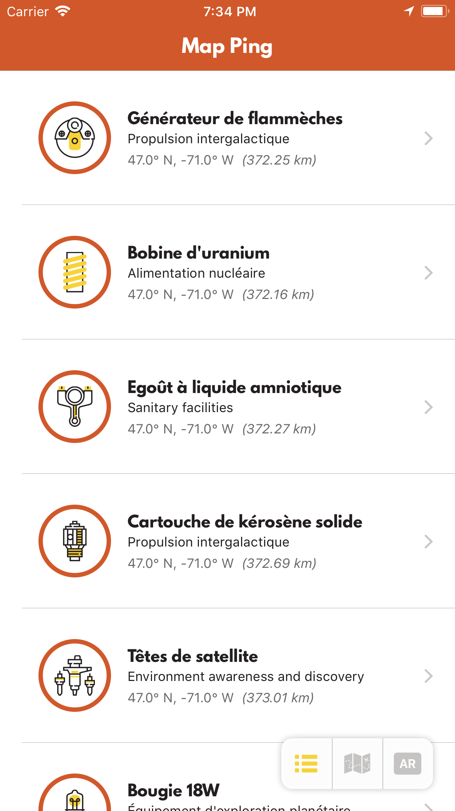
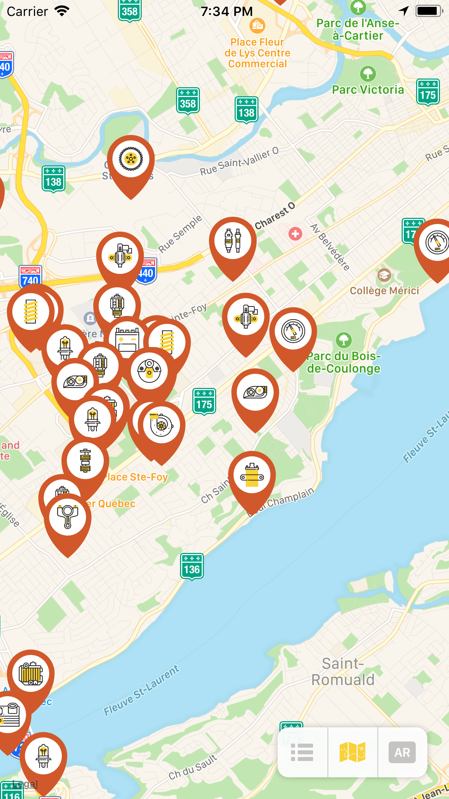

# CS Games 2018 - Mobile Competition

This repository contains code from the University of Ottawa RNGelicals team submission for the 2018 CS Games mobile competition.

Created by Gabriel Tapuc and Joseph Roque

## Screenshots

<table>
    <thead>
        <tr>
            <th colspan="4">Map Ping</th>
        </tr>
    </thead>
    <tbody>
        <tr>
            <td><a href="./Screenshots/list.png" target="_blank"></a></td>
            <td><a href="./Screenshots/map.png" target="_blank"></a></td>
            </tr>
            <tr>
            <td><em>Part list</em></td>
            <td><em>Map</em></td>
        </tr>
    </tbody>
</table>

## Prerequisites

Make sure you have the following software installed before beginning:

- Latest version of Xcode (9.2)
- Recent version of the iOS SDK (at least 11.0)

You can download these from the [Apple Developer website](https://developer.apple.com/downloads/).

> **NOTE:** You need a Mac computer running macOS 10.12.6 or later. If you don't have one, go to our [Android app](https://github.com/mirego/csgames18-competition/tree/master/android), which can be run on Windows, Linux and older versions of macOS.

## Getting started

First, make sure you have cloned the project from Github:

```
git clone http://github.com/mirego/csgames18-competition.git
```

This project uses [CocoaPods](https://cocoapods.org/) as a dependency manager. If you don't have it already, install it with the following command:

```
sudo gem install cocoapods
```

Then fetch dependencies and build the workspace:

```
pod install
```

When completed, the project should be ready to open:

```
open MapPing.xcworkspace
```

If the request to AWS is failing, replace it with the static `mapping.json` file.

# Mirego mobile challenge announcements

## License

This competition is © 2018 [Mirego](http://www.mirego.com) and may be freely
distributed under the [New BSD license](http://opensource.org/licenses/BSD-3-Clause).
See the [`LICENSE.md`](https://github.com/mirego/csgames18-competition/blob/master/LICENSE.md) file.

## About Mirego

[Mirego](http://mirego.com) is a team of passionate people who believe that work is a place where you can innovate and have fun. We're a team of [talented people](http://life.mirego.com) who imagine and build beautiful Web and mobile applications. We come together to share ideas and [change the world](http://mirego.org).

We also [love open-source software](http://open.mirego.com) and we try to give back to the community as much as we can.

